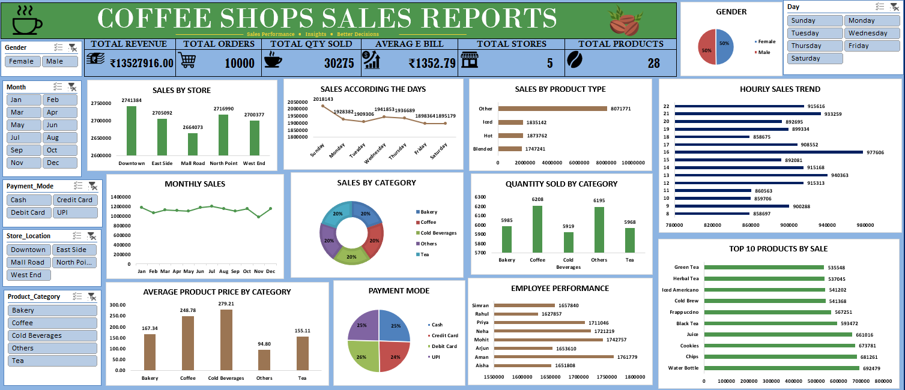

# ☕ Coffee Shop Sales Dashboard


An interactive, fully dynamic Excel dashboard built to track, visualize, and analyze end-to-end sales performance for a multi-store coffee shop chain. This project transforms raw transactional sales data into a single, decision-ready view — covering revenue trends, product performance, customer patterns, employee performance, and store-wise breakdowns.



---

## 📑 Table of Contents

- [Overview](#-overview)
- [Key Features](#-key-features)
- [Dashboard Metrics](#-dashboard-metrics-sample-snapshot)
- [Dashboard Sections Explained](#-dashboard-sections-explained)
- [Tools & Techniques Used](#-tools--techniques-used)
- [Repository Contents](#-repository-contents)
- [Key Insights](#-key-insights)
- [How to Use](#-how-to-use)
- [Skills Demonstrated](#-skills-demonstrated)
- [Future Improvements](#-future-improvements)
- [Author](#-author)

---

## 📌 Overview

This dashboard consolidates coffee shop sales data into a single, interactive view built entirely in **Microsoft Excel** — no external BI tool required. It enables stakeholders (store managers, business owners, or business analysts) to:

- Monitor real-time-style KPIs at a glance
- Identify best-selling products and top-performing stores
- Track sales patterns by day, hour, and month to optimize staffing and inventory
- Compare employee performance across the chain
- Understand customer behavior through gender, payment mode, and category-wise trends
- Slice and filter data instantly using interactive slicers, without touching a single formula

The goal of this project was to simulate a real-world retail/F&B business intelligence dashboard using only native Excel capabilities — Pivot Tables, Pivot Charts, and Slicers — to deliver a clean, professional, and fully interactive reporting tool.

---

## ✨ Key Features

- 📊 **KPI Summary Cards** — Total Revenue, Total Orders, Total Quantity Sold, Average Bill, Total Stores, and Total Products, all visible at the top of the dashboard
- 🎚️ **Interactive Slicers** — Filter the entire dashboard instantly by Gender, Month, Payment Mode, Store Location, Product Category, and Day
- 🏬 **Sales by Store** — Bar chart comparing revenue across all 5 store locations
- 📅 **Sales According to the Days** — Line chart tracking sales trends across each day of the week
- 🧁 **Sales by Product Type** — Bar chart comparing revenue across Hot, Iced, Blended, and Other product types
- ⏰ **Hourly Sales Trend** — Bar chart showing sales performance hour by hour (8 AM to 10 PM), ideal for staffing decisions
- 📈 **Monthly Sales** — Line chart tracking revenue trends across all 12 months
- 🍩 **Sales by Category** — Donut chart showing revenue distribution across Bakery, Coffee, Cold Beverages, Others, and Tea
- 📦 **Quantity Sold by Category** — Bar chart comparing units sold across each product category
- 🏆 **Top 10 Products by Sale** — Horizontal bar chart ranking the best-selling products
- 💲 **Average Product Price by Category** — Bar chart comparing average price points across categories
- 💳 **Payment Mode Split** — Pie chart showing revenue share across Cash, Credit Card, Debit Card, and UPI
- 👨‍💼 **Employee Performance** — Horizontal bar chart ranking staff by total sales generated
- 👥 **Gender-wise Sales Split** — Pie chart comparing sales share between Male and Female customers
- 🎨 **Custom Themed Design** — Clean, warm coffee-shop-inspired color palette (green, brown, and navy tones) for a professional, on-brand look

---

## 📊 Dashboard Metrics (Sample Snapshot)

| Metric | Value |
|---|---|
| 💰 Total Revenue | ₹1,35,27,916.00 |
| 🛒 Total Orders | 10,000 |
| ☕ Total Quantity Sold | 30,275 |
| 🧾 Average Bill | ₹1,352.79 |
| 🏬 Total Stores | 5 |
| 🌱 Total Products | 28 |

---

## 🧩 Dashboard Sections Explained

### 1. KPI Cards (Top Row)
Six high-level metrics giving an instant health check of the business — total revenue, order volume, quantity sold, average bill value, store count, and product range.

### 2. Sales by Store
A bar chart comparing total revenue generated by each of the 5 store locations — Downtown, East Side, Mall Road, North Point, and West End.

### 3. Sales According to the Days
A line chart tracing revenue across each day of the week, useful for identifying peak sales days (Sunday shows the highest at ₹20,18,143).

### 4. Sales by Product Type
A bar chart comparing revenue contribution from Hot, Iced, Blended, and Other product types — with "Other" leading at over ₹80 lakh.

### 5. Hourly Sales Trend
A bar chart breaking down sales by hour of day (8 AM–10 PM), highlighting peak business hours — extremely useful for shift planning and staffing.

### 6. Monthly Sales
A line chart tracking revenue trends month by month across the year, helping identify seasonal patterns.

### 7. Sales by Category
A donut chart showing how revenue is evenly distributed (~20% each) across Bakery, Coffee, Cold Beverages, Others, and Tea.

### 8. Quantity Sold by Category
A bar chart comparing the number of units sold per category, complementing the revenue-based category view.

### 9. Average Product Price by Category
A bar chart comparing the average selling price across categories — Cold Beverages command the highest average price (₹279.21).

### 10. Payment Mode
A pie chart showing an almost even split of revenue across Cash, Credit Card, Debit Card, and UPI payment methods.

### 11. Employee Performance
A horizontal bar chart ranking all staff members by total sales generated — useful for performance reviews and incentive planning.

### 12. Top 10 Products by Sale
A horizontal bar chart listing the best-selling individual products, led by Water Bottle, Chips, and Cookies.

### 13. Gender Split
A pie chart showing an even 50/50 split in sales between male and female customers.

### 14. Slicer Panel
A left-hand and top-right control panel with six slicers (Gender, Month, Payment Mode, Store Location, Product Category, Day) that instantly filter every chart and KPI on the dashboard simultaneously.

---

## 🛠️ Tools & Techniques Used

- **Microsoft Excel**
  - Pivot Tables & Pivot Charts
  - Slicers for multi-dimensional interactive filtering
  - Formula-based KPI calculations (SUM, AVERAGE, COUNT-based aggregations)
  - Custom dashboard layout design & conditional formatting
  - Data visualization: bar charts, line charts, pie charts, and donut charts
  - Data cleaning and structuring for pivot-based reporting

---

## 📂 Repository Contents

```
├── Coffee_Shop_Dashboard.xlsx    # Main Excel dashboard file (with raw data + dashboard sheet)
├── Coffee_Shop_Dashboard.png     # Dashboard preview image
└── README.md                     # Project documentation
```

---

## 🔍 Key Insights

- ☕ **Sunday** is the highest sales day (₹20,18,143), noticeably ahead of the rest of the week — indicating strong weekend footfall
- 🏬 **North Point** (₹27,16,990) and **Downtown** (₹27,41,384) are the top-performing stores, while **Mall Road** (₹26,64,073) trails slightly behind
- 🥤 **"Other"** product type dominates revenue (₹80,71,771), far ahead of Iced, Hot, and Blended categories combined
- ⏰ **Hour 16 (4 PM)** sees the highest hourly sales (₹9,77,606), suggesting a strong afternoon rush — useful for staffing decisions
- 🍩 Revenue is **evenly distributed across all 5 product categories** (~20% each), showing a well-balanced product mix with no over-reliance on a single category
- 💲 **Cold Beverages** have the highest average price point (₹279.21) while **Others** has the lowest (₹94.80)
- 👨‍💼 **Aman** (₹17,61,779) and **Arjun** (₹16,53,610) are top performers on the employee leaderboard, with fairly close competition across the team
- 🏆 **Water Bottle**, **Chips**, and **Cookies** are the top 3 best-selling individual products by volume
- 👥 Customer base is **perfectly gender-balanced** (50% Male / 50% Female), indicating broad market appeal
- 💳 Payment methods are **evenly split** across Cash, Credit Card, Debit Card, and UPI — showing no strong customer bias toward any single payment channel

---

## 🚀 How to Use

1. Download `Coffee_Shop_Dashboard.xlsx` from this repository
2. Open the file in **Microsoft Excel (2016 or later recommended)** for full slicer support
3. Navigate to the **Dashboard** sheet
4. Use the slicers to filter by:
   - Gender (Male / Female)
   - Month (Jan–Dec)
   - Payment Mode (Cash / Credit Card / Debit Card / UPI)
   - Store Location (Downtown / East Side / Mall Road / North Point / West End)
   - Product Category (Bakery / Coffee / Cold Beverages / Others / Tea)
   - Day (Sunday–Saturday)
5. All KPI cards and charts will update dynamically in real time based on your selections
6. Reset any slicer by clicking the "clear filter" icon on the top-right of the slicer box

---

## 🎯 Skills Demonstrated

- Data visualization & dashboard design
- Pivot Table and Pivot Chart creation
- Interactive filtering using Slicers
- Retail/F&B business analysis and insight generation
- KPI identification and reporting
- Time-based sales analysis (hourly, daily, monthly trends)
- Dashboard UI/UX layout planning in Excel

---

## 📈 Future Improvements

- Add a store-wise drill-down view for deeper location-level analysis
- Correlate hourly sales trends with staffing levels to optimize labor cost
- Add a customer loyalty/repeat purchase tracking metric
- Automate data refresh using Power Query for live/external data sources
- Migrate to Power BI for enhanced interactivity and cloud sharing capability

---

## 👤 Author

**Kartikey Gautam**

[](https://www.linkedin.com/in/kartikey-gautam-903711382/)
[](https://github.com/gautam2007kartikey-tech)

Feel free to connect or reach out for feedback, collaboration, or suggestions!
